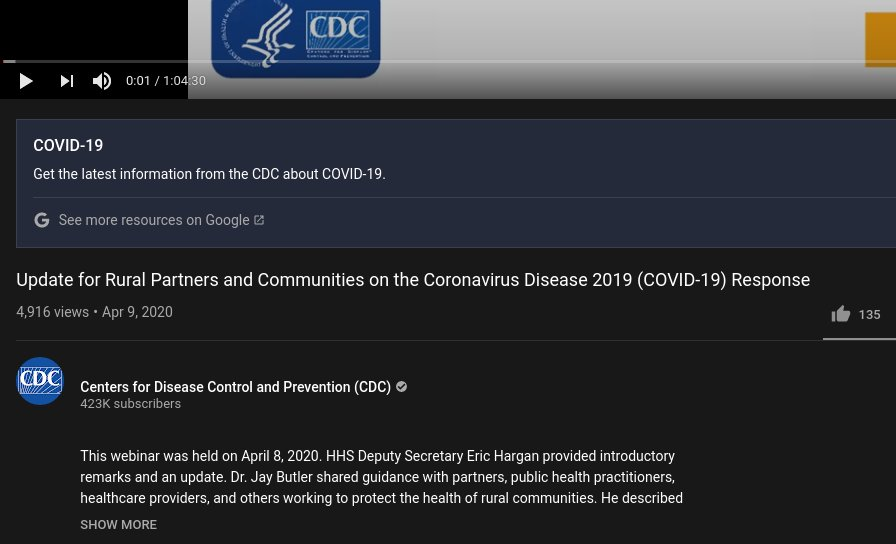
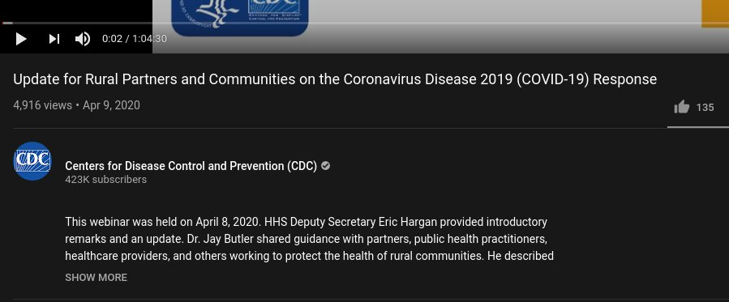

# A collection of my custom made user scripts
My user scripts. Mainly a place to keep them updated across multiple devices.

You'll need either [Greasemonkey](https://www.greasespot.net) or [Tampermonkey](https://www.tampermonkey.net) installed then click the script to install.

# Remove Youtube Fact Boxes
Userscript for Greasemonkey/Tampermonkey type extension to get rid of those annoying 'fact clarification' boxes on Youtube.

These things:

What is the point of putting a "listen to the CDC" on a video from the CDC official account? This is beyond too dumb to go along with, so this script gets rid of those:

[here to install](https://github.com/amckee/UserScripts/raw/main/remove_fact_boxes.user.js)

# Remove Cookie Dialogs

Some sites issue a pop up dialog to ask permission to create cookies. This was made much, much more prevalent after GDPR. Given that my browser deletes all cache/cookies anyways it's a (albeit small) waste of time over and over and over. I've started ignoring them, but some actually overlap the page I'm on making the site useless until a click is issued. This project is my attempt to stop this, though I'll bet there are already better options out there.

[here to install](https://github.com/amckee/UserScripts/raw/main/remove_cookie_dialogs.user.js)
